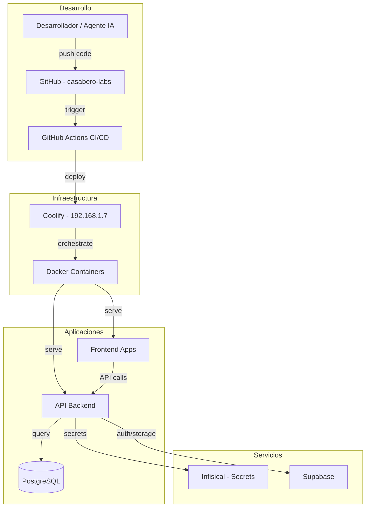
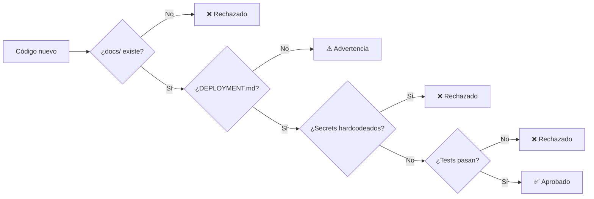
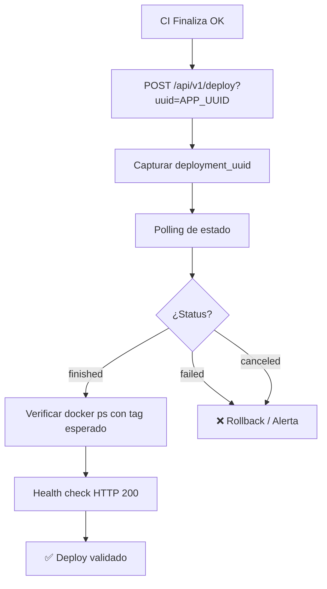
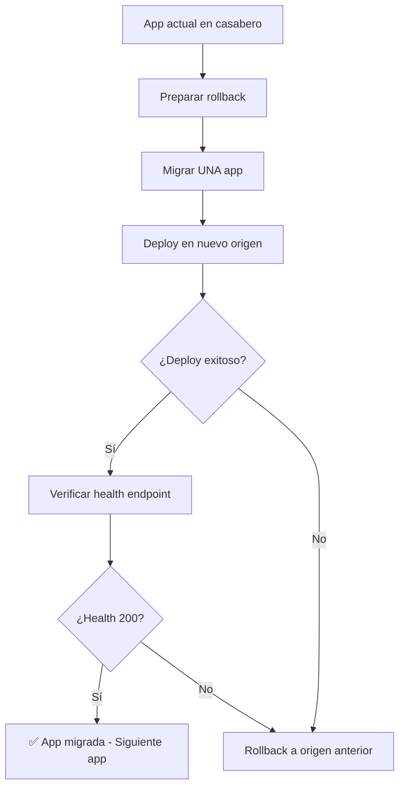
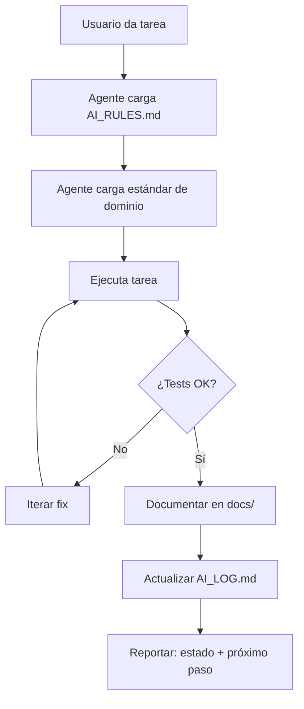

# Diagramas de Arquitectura y Flujos

Documentación visual del ecosistema Casabero usando Mermaid (compatible con GitHub Markdown).

## Arquitectura General del Ecosistema

## Flujo de Validación de Estándares

## Flujo de Deploy en Coolify

## Flujo de Migración de Repositorio (casabero → casabero-labs)

## Ciclo de Vida del Agente IA

